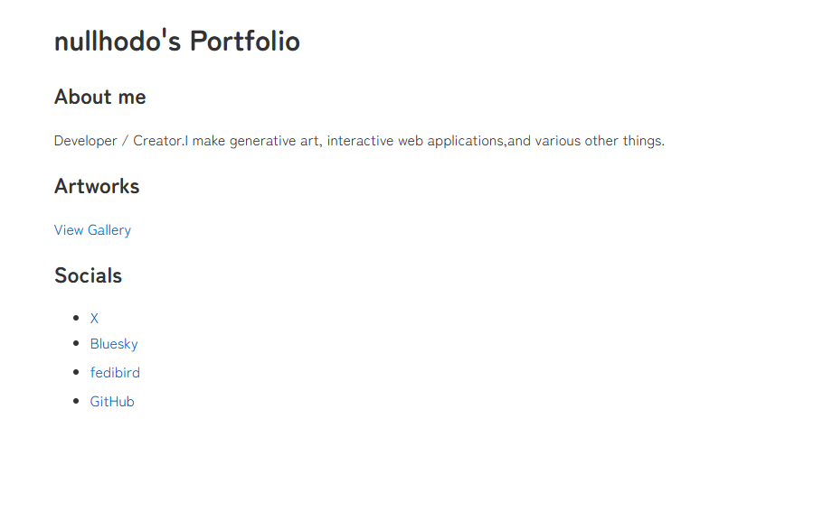

# nullhodo.com

My personal portfolio and generative art archive website.

Website: https://nullhodo.com/



## Structure

```text
nullhodo.com/
├── public/
│   ├── assets/              - Static assets (OGP image, screenshot)
│   └── favicon.ico
├── src/
│   ├── assets/artworks/     - Artwork and generative sketch images
│   ├── pages/
│   │   ├── index.astro      - Top page
│   │   └── artworks.astro   - Gallery page
│   └── styles/
│       └── global.css
├── astro.config.mjs
└── package.json
```

## Development

| Command        | Action                                 |
| :------------- | :------------------------------------- |
| `pnpm install` | Install dependencies                   |
| `pnpm dev`     | Starts local dev server                |
| `pnpm build`   | Build the production site to `./dist/` |
| `pnpm preview` | Preview the build locally              |

## Image Optimization Specification

Images in the artworks page are optimized using Astro assets and sharp.

- Location: `src/assets/artworks/`
- Aspect ratio: Cropped to 4:3 (centered) using CSS `object-fit`.
- Format: Converted to WebP format with metadata removed.
- Automatic updates: Adding new image files matching `genart-misc-*.ext` to `src/assets/artworks/` will automatically display them in the other sketches gallery without code changes.
